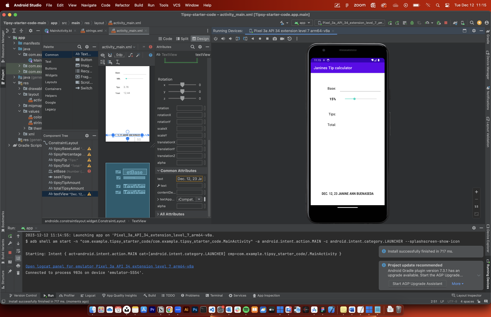
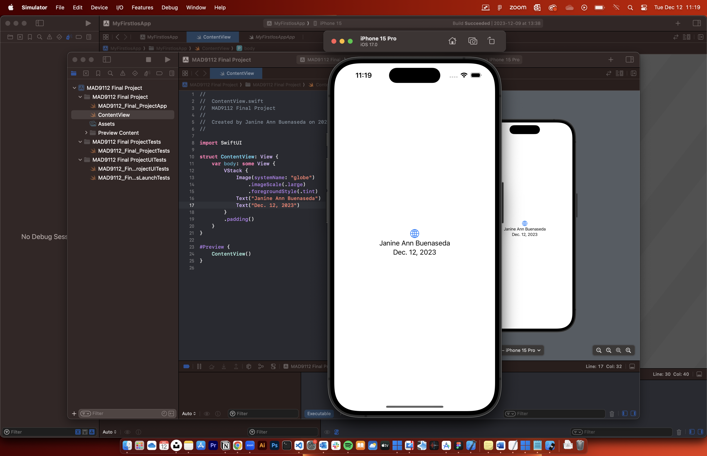
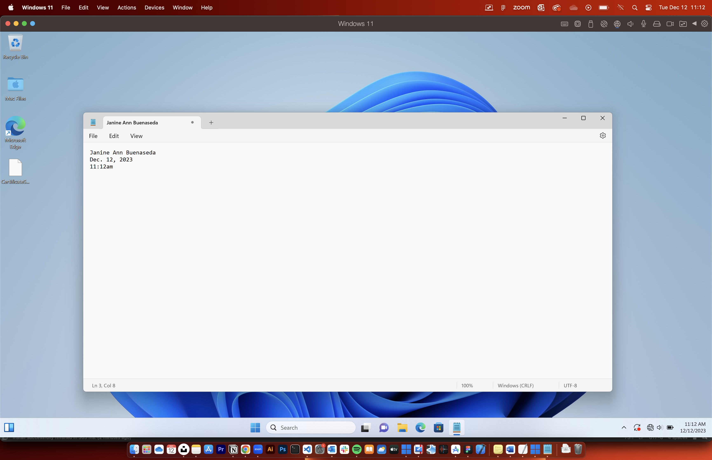

# JanineAnn_Buenaseda_FinalProject

```
function getDaysUntilChristmas(){
  let date = new Date();
  let today = date.getDate();
  let daysUntilChristmas = 25 - today;
  return daysUntilChristmas;
}

console.log(`Days until Christmas: ${getDaysUntilChristmas()} days`);
```


